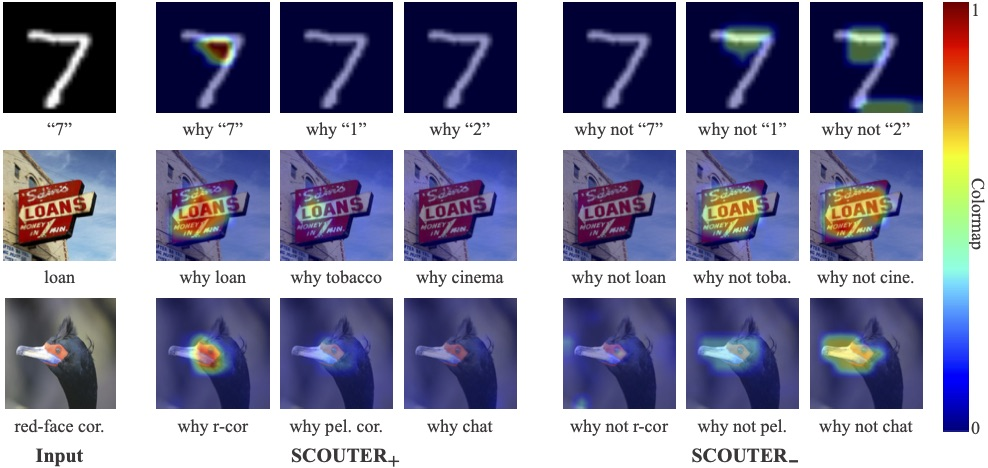
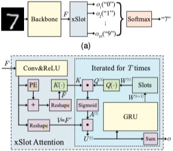

# Classificazione dei rifiuti inorganici mediante Convolutional Neural Network 

Progetto di Tesi presso l'Università "Parthenope" di Napoli.

Classificatore originale --> https://arxiv.org/abs/2009.06138



## Struttura del modello


S.C.O.U.T.E.R. (Slot-based COnfigUrable and Transparent classifiER) è un classificatore di immagini che, sulla base delle features in input, è in grado di fornire contemporaneamente, sia una scelta predittiva, cioè l’associazione di una classe all’immagine, sia una spiegazione visiva che motivi la scelta stessa. Questa è realizzata dalla cosiddetta ‘Colormap’, un indice di somiglianza che, effettivamente, localizza e misura, dove e quanto, un’immagine si avvicini ad una specifica classe, o meglio, dove e quanto vengono individuate le sue caratteristiche già apprese, i suoi pattern conosciuti. Esistono due tipologie di SCOUTER:
SCOUTER+, illustra il motivo per cui, una data immagine, appartiene ad una specifica classe;
SCOUTER-, invece, spiega il motivo per cui, una data immagine, NON appartiene ad una specifica classe.
SCOUTER si basa sullo slot attention che offre un approccio oggetto centrico, per l'estrazione di caratteristiche dalle immagini. In particolare, il modulo di attenzione xSlot è una variante ad hoc per SCOUTER, per cui ogni slot è associato ad una categoria assicurando che l'immagine di input, rientri in una di queste. In questo modo, non sono più necessari i classficatori FC (Full-Connected) solitamente utilizzati. L'intera rete neurale, inclusa la backbone, è addestrata attraverso la SCOUTER loss, che fornisce la possibilità di controllare le dimensioni delle regioni esplicative e di alternare tra motivazioni positive e negative. 

## Manuale d'uso

###### Abilitazione addestramento distribuito (opzionale)

```bash
python -m torch.distributed.launch --nproc_per_node=4 --use_env train.py --world_size 4
```


###### Pre-train modello base su dataset CUB-200

```bash
python train.py --world_size 1 --dataset CUB200 --model resnest50d --epochs 50 \
 --num_classes 4 --use_slot false --vis false --channel 2048 \
 --dataset_dir [...]/Immagini_DATASET/Dataset_2 --num_workers 1
 #--lr 0.00001 --batch_size 128
 #--lr 0.001 --batch_size 32
```

##### Train SCOUTER+ su dataset CUB-200

```bash
python train.py --world_size 1 --dataset CUB200 --model resnest50d --epochs 50 \
 --num_classes 4 --use_slot true --use_pre true --loss_status 1 --slots_per_class 5 \
 --power 2 --to_k_layer 3 --lambda_value 10 --vis false --channel 2048 --freeze_layers 2 \
 --dataset_dir [...]/Immagini_DATASET/Dataset_2 --num_workers 1 \
 #--lr 0.00001 --batch_size 128
 #--lr 0.001 --batch_size 32
```

##### Test SCOUTER+ su dataset CUB-200

```bash
python test.py --dataset CUB200 --model resnest50d --epochs 50 \
 --num_classes 4 --use_slot true --use_pre true --loss_status 1 --slots_per_class 5 \
 --power 2 --to_k_layer 3 --lambda_value 10 --vis true --channel 2048 --freeze_layers 2 \
 --dataset_dir [...]/Immagini_DATASET/Dataset_2 --num_workers 1
```


Anno Accademico 2023/2024